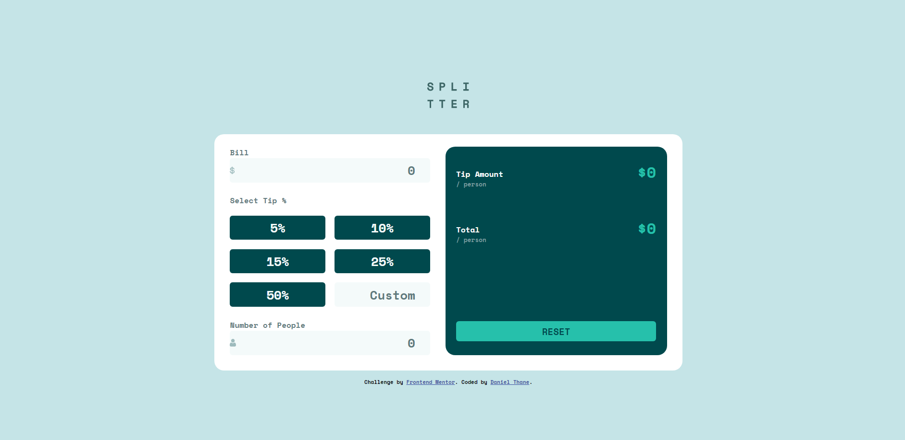

# Frontend Mentor - Tip calculator app solution

This is a solution to the [Tip calculator app challenge on Frontend Mentor](https://www.frontendmentor.io/challenges/tip-calculator-app-ugJNGbJUX). Frontend Mentor challenges help you improve your coding skills by building realistic projects.

## Table of contents

- [Frontend Mentor - Tip calculator app solution](#frontend-mentor---tip-calculator-app-solution)
  - [Table of contents](#table-of-contents)
  - [Overview](#overview)
    - [The challenge](#the-challenge)
    - [Screenshot](#screenshot)
    - [Links](#links)
  - [My process](#my-process)
    - [Built with](#built-with)
    - [What I learned](#what-i-learned)
    - [Continued development](#continued-development)
  - [Author](#author)

## Overview

### The challenge

Users should be able to:

- View the optimal layout for the app depending on their device's screen size
- See hover states for all interactive elements on the page
- Calculate the correct tip and total cost of the bill per person

### Screenshot



### Links

- Solution URL: [Source Code Here](https://github.com/danielthane/Tip-Calculator)
- Live Site URL: [GitHub Pages Link](https://danielthane.github.io/Tip-Calculator/)

## My process

### Built with

- Semantic HTML5 markup
- CSS custom properties
- Flexbox
- CSS Grid
- Mobile-first workflow

### What I learned

In this porject, I took the ideas of DOM manipulation further than I have done previously. I learned a substancial ammount about using both CSS grid and flexbox to create layouts and feel like the design is fairly close to the original. I even got this media query up and running which I'm really proud of myself for!

```css
@media screen and (min-width: 750px) {
  .main-container {
    border-radius: 20px;
    display: flex;
    height: 100%;
    gap: 2rem;
  }
  .input-container {
    flex: 1;
  }
  .result-container {
    flex: 1;
    gap: 3rem;
  }
  .reset {
    margin-top: 7rem;
  }
}
```

As far as I can see, the program functions well without any bugs!!

I focussed on refactoring code more than in my previous projects and even used functions within functions, like in the updateResults function below.

```js
function updateResults() {
  if (people > 0) {
    tip = billStartingVal * (tipPercentage / 100);
    document.getElementById("tip-per-person").textContent = calcTip();
    document.getElementById("total-per-person").textContent = calcBill();
  }
}
```

All in all this was a fun project which has to be completely honest given me a boost in motivation, seeing something that I've created functioning so well!

### Continued development

The one area that I'm not fully happy without, sounds really picky but I would love to know how to implement this properly...The icons inside of the input fields, I think I could've used relative positioning to get these sorted but I wasn't sure and had spent ages googling!!

## Author

- Linkedin - [Daniel Thane](https://www.linkedin.com/in/daniel-thane-924576135/)
- Frontend Mentor - [@danielthane](https://www.frontendmentor.io/profile/danielthane)
